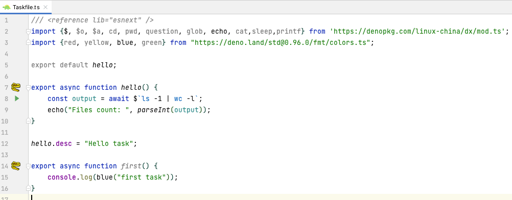

dx: A tool/runner for writing better scripts
==========================================

dx is a tool and task runner for writing better scripts with Deno, and origin idea is from [https://github.com/google/zx/](https://github.com/google/zx/).

# why a dx instead of Google zx

dx is based on Deno and with following pros:

* TypeScript friendly
* Task runner support: Taskfile.ts/Taskfile.js to manage tasks
* Easy to import third party modules, just `import {red, green} from "https://deno.land/std@0.96.0/fmt/colors.ts"`, no idea about zx to import third party npm(package.json???)
* More features: alias, export, `$a` for async iterable line output, file globs, .env support etc
* I ❤️ 🦕

# Install

```bash
deno install -q -A --unstable -r -f -n dx https://denopkg.com/linux-china/dx/cli.ts
```

# Get started

Create a `demo.ts` file with following code:

```typescript
#!/usr/bin/env dx
import {$, cd, pwd, question, os, fs, env, printf, glob, $a, echo} from "https://denopkg.com/linux-china/dx/mod.ts";
import {red, yellow, blue, green} from "https://deno.land/std@0.96.0/fmt/colors.ts";

// aliases
$.alias("ll", "ls -al");

// prompt to input your name
let name = await question(blue("what's your name: "));
echo("Hello ", blue(name ?? "guest"));

// pwd(), env variables and params
echo("Current working directory:", pwd());
echo("Your home:", HOME);
echo("Your name:", USER);
echo("Script name:", $0);

// current file count
const output = await $`ls -1 | wc -l`;
echo("Files count: ", parseInt(output));

// output as lines
for await (const fileName of $a`ls -1 *.ts`) {
    echo("TS file: ", fileName);
}

// alias and output as lines
for await (const fileName of $a`ll *.ts`) {
    echo("TS file: ", fileName);
}

// print your internet outbound ip
let json = await fetch('https://httpbin.org/ip').then(resp => resp.json());
echo("Your ip: ", json.origin)

//printf
printf("hello %s\n", "world");

//glob *.ts
for await (const fileName of glob("*.ts")) {
    echo(`${pwd()}/${fileName}`);
}
```

Then run `dx demo.ts` or `chmod u+x demo.ts ; ./demo.ts`'

# Task runner support: Taskfile.ts or Taskfile.js

`Taskfile.ts` or `Taskfile.js` is file to manage tasks, and you can use dx to run the task.

The task is normal TypeScript's function with export directive, example as following:

```typescript
/// <reference lib="esnext" />
import {$, cd, pwd, question, os, fs, env, printf, glob, $a, echo} from "https://denopkg.com/linux-china/dx/mod.ts";
import {red, yellow, blue, green} from "https://deno.land/std@0.96.0/fmt/colors.ts";

export default hello;

export async function hello() {
    echo(green("Hello"));
}

hello.desc = "Hello task";

export async function first() {
    console.log(blue("first task"));
}
```

Then execute `dx hello` to run task.

* `dx --tasks` to list tasks in `Taskfile.ts` or `Taskfile.js`
* Task names completion with o-my-zsh. Please add dx to plugins in `~/.zshrc`.

```bash
mkdir -p ~/.oh-my-zsh/custom/plugins/dx/
dx -c zsh > ~/.oh-my-zsh/custom/plugins/dx/_dx
```

# functions and variables

```typescript
import {$, cd, pwd, question, os, fs, env} from "https://denopkg.com/linux-china/dx/mod.ts";
```

* cd: change current working directory. `cd('../')` or `cd('~/')`
* pwd: get current working directory
* echo:  dump object as text on terminal
* printf:  format output
* getops:  grab arguments into object
* test: single file test only, such as `if(test('-e mod.ts')) { }`
* $.alias: introduce alias for command. `$.alias("ll", "ls -al")`
* $.export: export env variable for command.  `$.expoort('NO_COLOR','true');`
* cat:  read text file as string
* read/question: read value from stdin with prompt
* sleep: `await sleep(5);`
* os: OS related functions
* fs: file system related functions
* glob:  glob files, like commands `ls -1 *.ts`

```typescript
// 
for await (const fileName of glob("*.ts")) {
    console.log(fileName);
}
```

* env: env global object `env.get("HOME")`
* Shell params support: $0(script name), $1 to $9, $['@'] for all arguments, $['#'] for number of arguments, $['*'] for params as a string
* Shell env variables as global variables in TypeScript automatically.

```typescript
// builtin env variables for hint, such as USER, HOME, PATH
const output = await $`ls -al  ${HOME}`;
console.log(HOME);

// custom env variables for hint
declare global {
    const JAVA_HOME: string;
}
```

# Execute command

dx supplies three styles to run command, and they are `$`, `$o` and `$a`.

### $: execute command with stdout capture

Use `$` tag to execute command and return value captured stdout.

```typescript
let count = parseInt(await $`ls -1 | wc -l`)
console.log(`Files count: ${count}`)
```

### $o: execute command with stdout and stderr

Use `$o` tag to execute command with stdout and stderr output.

```typescript
await $o`ls -al`
```

### $a: execute command and convert output into async iterable lines

Use `$a` tag to execute command and capture stdout and convert output into async iterable lines, then use `for await...of` to iterate the lines.

```typescript
for await (const fileName of $a`ls -1 *.ts`) {
    console.log("file: ", fileName);
}
```

### command error handler

If exit code is not 0, and exception will be thrown.

```typescript
try {
    await $`exit 1`
} catch (p) {
    console.log(`Exit code: ${p.exitCode}`)
    console.log(`Error: ${p.stderr}`)
}
```

# color output

Deno std has `fmt/colors.ts` already, and you don't need chalk for simple cases.

```typescript
import {red, yellow, blue, green} from "https://deno.land/std@0.95.0/fmt/colors.ts";

console.log(green("Hello"));
```

# $ configuration

* $.shell: set shell for the command and default is `which bash`
* $.prefix: prefix for every command line, default is `set -euo pipefail;` for strict mode.

# packages

* fs is for file system from https://deno.land/std@0.96.0/node/fs.ts
* os is for operating system from https://deno.land/std@0.96.0/node/os.ts

# Misc

* .env auto load
* Compile script into executable binary: `deno compile --unstable -A --lite demo.ts`
* dx JetBrains IDE plugin: https://plugins.jetbrains.com/plugin/16805-dx 



# References

* Google zx: https://github.com/google/zx
* dx JetBrains IDEs plugin: https://plugins.jetbrains.com/plugin/16805-dx  
* Bash Cheatsheet: https://devhints.io/bash https://shellmagic.xyz/
