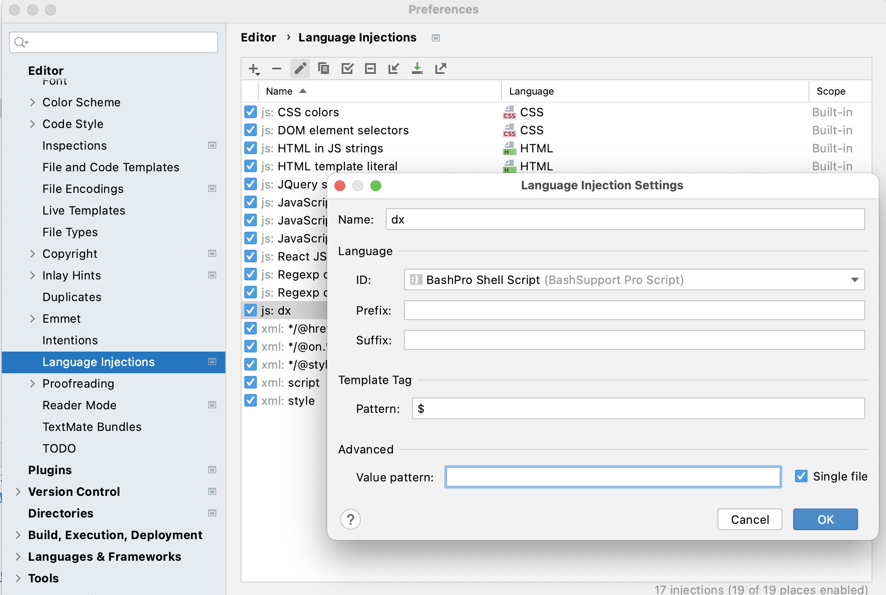

dx: A tool for writing better scripts with Deno
==========================================

# why a dx instead of Google zx

dx is based on Deno and with following pros:

* TypeScript friendly
* Easy to import third party modules, just `import {red, green} from "https://deno.land/std@0.95.0/fmt/colors.ts"`, no idea about zx to import third party npm(package.json???)
* More features: alias, `$a` for async iterable line output, file globs, .env support etc
* I ❤️ 🦕

# Install

```bash
deno install -q -A --unstable -r -f -n dx https://denopkg.com/linux-china/dx/cli.ts
```

# Demo

```typescript
#!/usr/bin/env dx
import {$, cd, pwd, question, os, fs, env, printf, glob, $a, echo} from "./mod.ts";
import {red, yellow, blue, green} from "https://deno.land/std@0.96.0/fmt/colors.ts";

// aliases
$.alias("ll", "ls -al");

// prompt to input your name
let name = await question(blue("what's your name: "));
echo("Hello ", blue(name ?? "guest"));

// pwd(), env variables and params
echo("Current working directory:", pwd());
echo("Your home:", HOME);
echo("Your name:", USER);
echo("Script name:", $0);

// current file count
const output = await $`ls -1 | wc -l`;
echo("Files count: ", parseInt(output));

// output as lines
for await (const fileName of $a`ls -1 *.ts`) {
    echo("TS file: ", fileName);
}

// alias and output as lines
for await (const fileName of $a`ll *.ts`) {
    echo("TS file: ", fileName);
}

// print your internet outbound ip
let json = await fetch('https://httpbin.org/ip').then(resp => resp.json());
echo("Your ip: ", json.origin)

//printf
printf("hello %s\n", "world");

//glob *.ts
for await (const fileName of glob("*.ts")) {
    echo(`${pwd()}/${fileName}`);
}
```

Then run `dx demo.ts` or `chmod u+x demo.ts ; ./demo.ts`'

# Taskfile.ts support

`Taskfile.ts` is file to manage runners, and you can use dx to run the task.

Task are normal TypeScript's function with export directive, example as following: 

```typescript
import {$, cd, pwd, question, os, fs, env, printf, glob, $a, echo} from "./mod.ts";
import {red, yellow, blue, green} from "https://deno.land/std@0.96.0/fmt/colors.ts";

export default hello;

export async function hello() {
    echo(green("Hello"));
}

export async function first() {
    console.log(blue("first task"));
}
```

Then run `dx hello` to run task.

* `dx tasks` to list tasks from `Taskfile.ts`
* `Taskfile.ts` is case-sensitive
* task name completions with o-my-zsh: `~/.oh-my-zsh/custom/plugins/dx/_dx`

```bash
#compdef dx
#autload

local subcmds=()

while read -r line ; do
   if [[ ! $line == Available* ]] ;
   then
      subcmds+=(${line/[[:space:]]*\#/:})
   fi
done < <(dx --tasks)

_describe 'command' subcmds
```

# functions and variables

```typescript
import {$, cd, pwd, question, os, fs, env} from "https://denopkg.com/linux-china/dx/mod.ts";
```

* cd: change current working directory. `cd('../')` or `cd('~/')`
* pwd: get current working directory
* echo:  dump object as text on terminal
* printf:  format output
* getops:  grab arguments
* test: single file test only, such as `test('-e mod.ts')'`
* $.alias: introduce alias for command. `$.alias("ll", "ls -al")`
* $.export: export env variable for command.  `$.expoort('ADMIN','xx');`
* cat:  read text file as string
* read/question: read value from stdin with prompt
* sleep: `await sleep(5);`
* os: OS related functions
* fs: file system related functions
* glob:  glob files, like commands `ls -1 *.ts`

```typescript
// 
for await (const fileName of glob("*.ts")) {
    console.log(fileName);
}
```

* env: env object
* shell params support: $0(script name), $1 to $9, $['@'] for all arguments, $['#'] for number of arguments, $['*'] for params as a string
* Support to treat shell env variables as global variables in TypeScript

```typescript
// builtin env variables for hint, such as USER, HOME, PATH
const output = await $`ls -al  ${HOME}`;
console.log(HOME);

// custom env variables for hint
declare global {
    const JAVA_HOME: string;
}
```

# execute command

Same with zx, example as following:

```typescript
let count = parseInt(await $`ls -1 | wc -l`)
console.log(`Files count: ${count}`)
```

**Attention:**: if exit code is not 0, and exception will be thrown.

```typescript
try {
    await $`exit 1`
} catch (p) {
    console.log(`Exit code: ${p.exitCode}`)
    console.log(`Error: ${p.stderr}`)
}
```

# execute command and convert output into async iterable lines

If you want to convert output into lines, and you can use `$a`, then use `for await...of` to iterate the lines.

```typescript
for await (const fileName of $a`ls -1 *.ts`) {
    console.log("file: ", fileName);
}
```

# color output

Deno std has `fmt/colors.ts` already, and you don't need chalk for simple cases.

```typescript
import {red, yellow, blue, green} from "https://deno.land/std@0.95.0/fmt/colors.ts";

console.log(green("Hello"));
```

# $ configuration

$.shell and $.prefix are same to zx

# packages

fs and os packages are same to zx, and use fs and os modules from https://deno.land/std@0.95.0/node

# Misc

* .env auto load
* Compile script into executable binary: `deno compile --unstable -A --lite demo.ts`
* Language Injections in WebStorm:  Settings -> Editor -> Language Injections, and add "JS Tagged Literal Injection" as following:



# References

* Google zx: https://github.com/google/zx
* Bash Cheatsheet: https://devhints.io/bash https://shellmagic.xyz/
